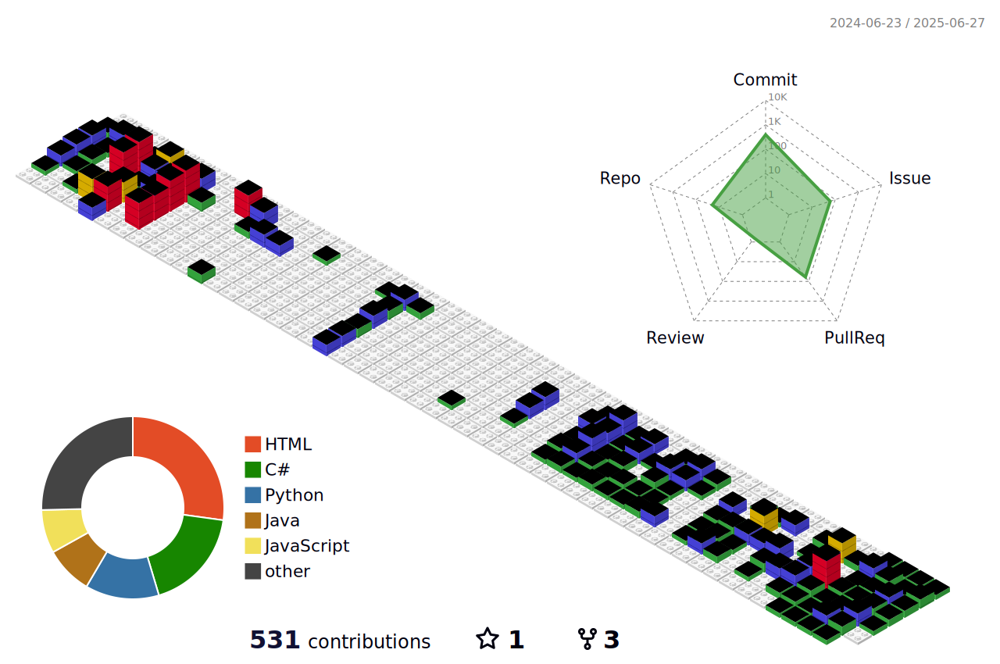

<!-- 대문 -->

  

<!-- 프로필 -->

 
    <h2 style="border-bottom: 1px solid #d8dee4; color: #282d33;"> Profile </h2>
    

      

        안녕하세요. 꾸준히 성장하고 싶은 개발자 꿈나무입니다.
      

    

    
 
      <h6>Contact Me</h6>
    
 

 
  
  
 

<!-- 언어, 툴 -->

  <h2 style="border-bottom: 1px solid #d8dee4; color: #282d33;"> Skills </h2>
  

    <h4> Platform & Languages </h4>
          &nbsp
          &nbsp
          &nbsp
          &nbsp
          &nbsp
          
           
          &nbsp
          &nbsp
          &nbsp
           
          &nbsp
          &nbsp
          
  

  

    <h4> Tools </h4>
    &nbsp
    &nbsp
    &nbsp
    &nbsp
    

  

<!-- 프로젝트 -->

  <h2 style="border-bottom: 1px solid #d8dee4; color: #282d33;"> Projects </h2>   
  

    

      
      

        야구 예매 사이트 만들기 <야모해!(야! 모해! 야구 얘매해!)>
      

    

    

      
      

        WMS 의류 물류 창고 시스템
      

    

    

      
      

        TypingGame 만들기
      

    

    

      
      

        MES 공정관리 시큘레이션
      

    

  
 

<!-- githubAnimail -->
<!--  -->
  
<!-- 
 
    <h2 style="border-bottom: 1px solid #d8dee4; color: #282d33;"> 🏅 Stats </h2> 
    
 
       
       
    
 

 -->

<!-- 구분선 -->
<!-- 
 
  <h2 style="border-bottom: 1px solid #d8dee4; color: #282d33;">  </h2>  
  
  
 

 -->

<!-- 

  <h2 style="border-bottom: 1px solid #d8dee4; color: #282d33;"> 🛠️ Tech Stacks </h2>   

 
          &nbsp
          &nbsp
          &nbsp
          &nbsp
          
           
          &nbsp
          &nbsp
          &nbsp
           
          &nbsp
          &nbsp
          
  

  <h2 style="border-bottom: 1px solid #d8dee4; color: #282d33;"> Using Tools </h2>   
  
 
    &nbsp
    &nbsp
    &nbsp
    
  
 

 -->
<!-- eclipse 추가해야 함! -->

<!-- 

  <h2 style="border-bottom: 1px solid #d8dee4; color: #282d33;"> 🧑‍💻 Contact me </h2>   
  
 
          
    
    
  
 

 -->

